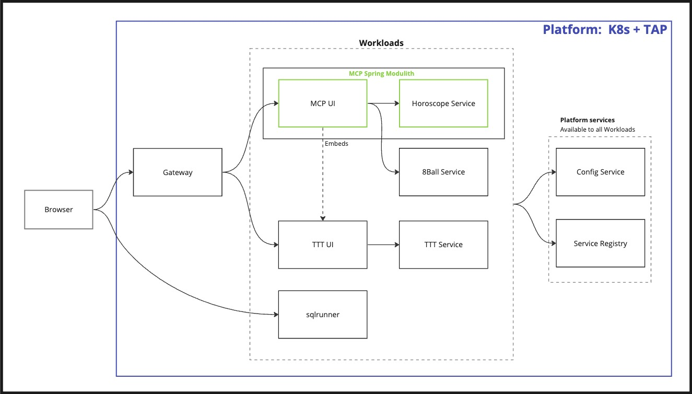

# Tanzu Demo Apps

As part of demonstrating the value of Tanzu products, it's useful to have a set of applications to use.  Especially if you want to dive into Spring concepts, like I do.

These are the apps in the demo suite and how they relate to each other.

([miro](https://miro.com/app/board/uXjVNWvnuFw=/#tpicker-content) - internal)

## The Applications

All the applications are targeted to run as Workloads on Tanzu Application Platform.  They can of course
be run on any K8s, Tanzu Application Service, containers, stand alone, etc..

### MCP

[GitHub](https://github.com/sdeeg-vmware/mcp)

A UI and Service in a single application based on the Spring Modulith project/opinions.

#### MCP UI

The MCP UI shows:

- The Oracle (retrieves data from Horoscope module)
- 8Ball (calls 8Ball Service)
- TTT (embeded)
- Link out to sqlrunner (maybe)

#### Horoscope

This module in MCP is a simple sentence generator.  It uses a data set that contains entries for various pieces of grammer, and randomly builds a sentence (or 2 or 3).  The default data set is for random horoscopes.

### 8Ball

[GitHub](https://github.com/sdeeg-vmware/go-eight-ball)

8Ball is a simple app that takes a set of Strings and randomly returns one when it's called.  The default set of strings is from the magic 8ball toy.

8Ball is written in Go, and show cases how simple it is to get up and running with other languages, and also how they completely lack all the enterprise features that Spring brings.

### TTT

[GitHub](https://github.com/sdeeg-vmware/ttt)

Tic Tac Toe.  Two parts.  A UI to interact with the user, and a Service that manages games.  There is a UI that is embedable.  It is an example of a multi-module "mono-repo".  Useful to show how Tanzu developer tools are able to work with multiple projects at the same time.

### sqlrunner

[GitHub](https://github.com/sdeeg-vmware/sqlrunner)

Kotlin/Spring application that can be used to make queries to a database via JDBC.  Single repo application.

## Security

Security will be challenging as I look to propogate calls through various routes.  Figuring out how to work with 8Ball should be extra interesting.